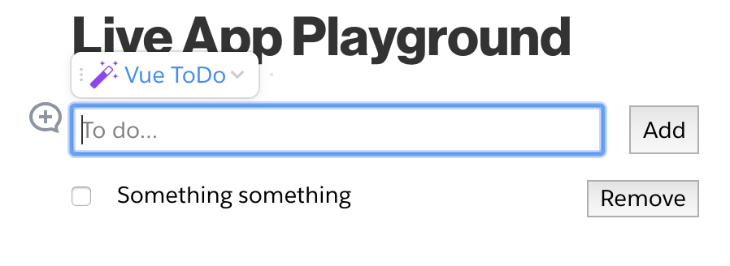
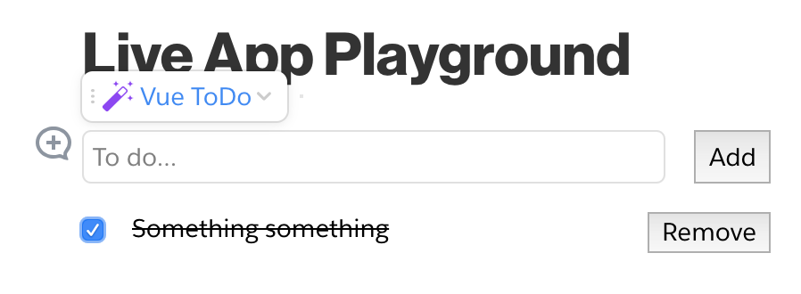
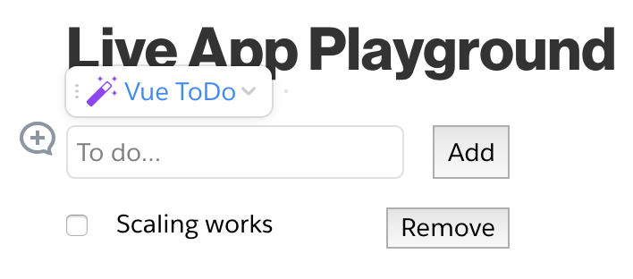

# quip-todo-vue
This is a version of th

## Installation
```
git clone https://github.com/herrevilkitten/quip-hello-vue
cd quip-hello-vue
npm install
```

## Instructions

For the most part, all of the deployment instructions from the [Quip Live App Developer Guide](https://salesforce.quip.com/dev/liveapps/) will also apply to this repository.

To run the development server, use the command

```
npm run start
```

To build a deployable application, use the command
```
npm run build
```

## Screenshots







## Caveats
* `webpack.config.js` has been customized.  It uses the default Quip configuration and then modifies it somewhat.  This means that if Quip changes the defaults, this file may need to be updated.

* With everything in Single File Components, `app.css` is not used (and is not in the manifest.)  If an external stylesheet is needed, the manifest may need to be updated.

* I have only put in support for LESS processing, because it was already listed in `package-lock.json`.  Adding SASS (or other processors) shouldn't be that difficult.

* You may run into CSP errors when loading the Live App inside of Quip.  I've done my best to clean up the problems.
